# GitHub

Администратор: @Maxim_TechLead_AVA (Telegram)

#### 1. Создать профиль на [GitHub](https://github.com/signup)
#### 2. Передать администратору имя пользователя или email на GitHub, чтобы он добавил вас в организацию
#### 3. Принять приглашение в организацию (оно придёт на почту, указанную в аккаунте)
#### 4. Создать репозиторий

После принятия приглашения из письма вас перенаправит на страницу организации. Также она доступна по [ссылке](https://github.com/avateam-bots). В организации необходимо создать репозиторий — можно считать, что это удалённая папка с вашими файлами.

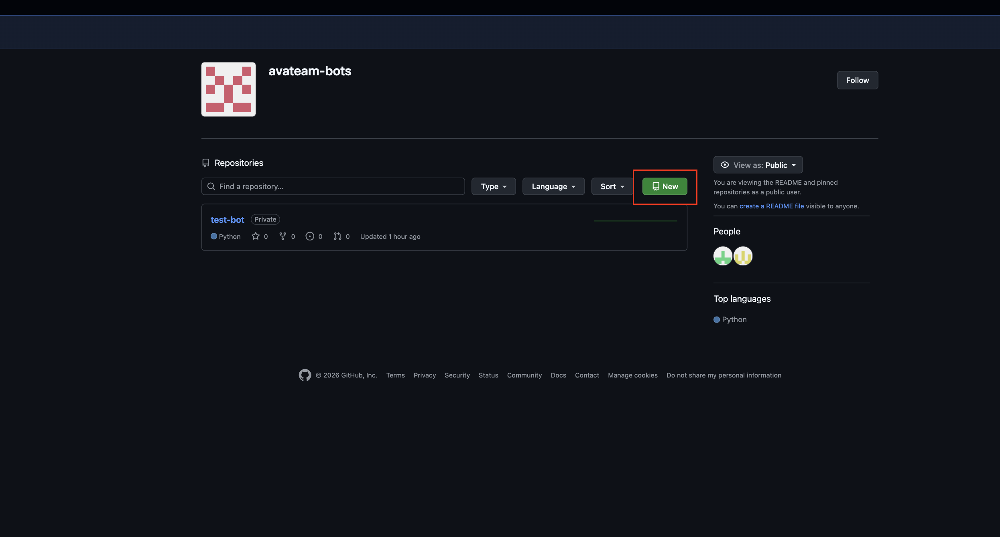

Далее нужно будет работать с репозиторием на компьютере: фиксировать изменения и отправлять их на GitHub.

Можете предоставить вашему агенту ссылку на репозиторий и попросить его настроить всё так, чтобы он мог самостоятельно делать коммиты и пушить в удалённый репозиторий. Но не забывайте просить его об этом по мере необходимости («Закоммить всё и запушь в main»). В любом случае лучше прочитать всё, что написано ниже.

Либо можно работать самостоятельно через GitHub Desktop.

#### 5. Скачать [GitHub Desktop](https://github.com/apps/desktop)

GitHub Desktop был выбран как простой способ синхронизации файлов на вашем компьютере с репозиторием на GitHub.

#### 6. Авторизоваться в GitHub Desktop

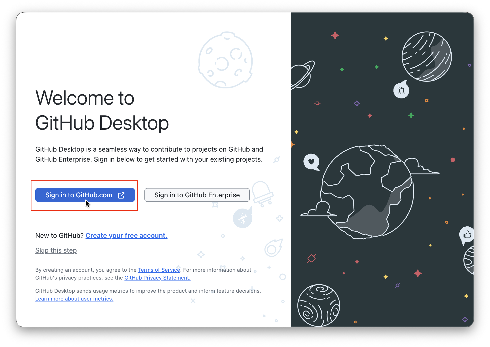
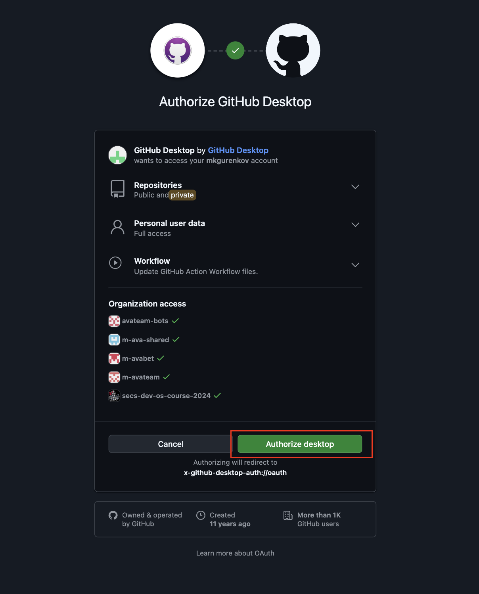
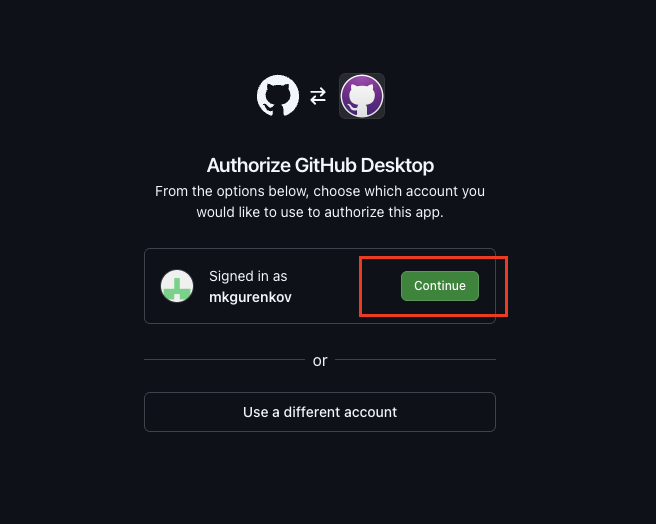
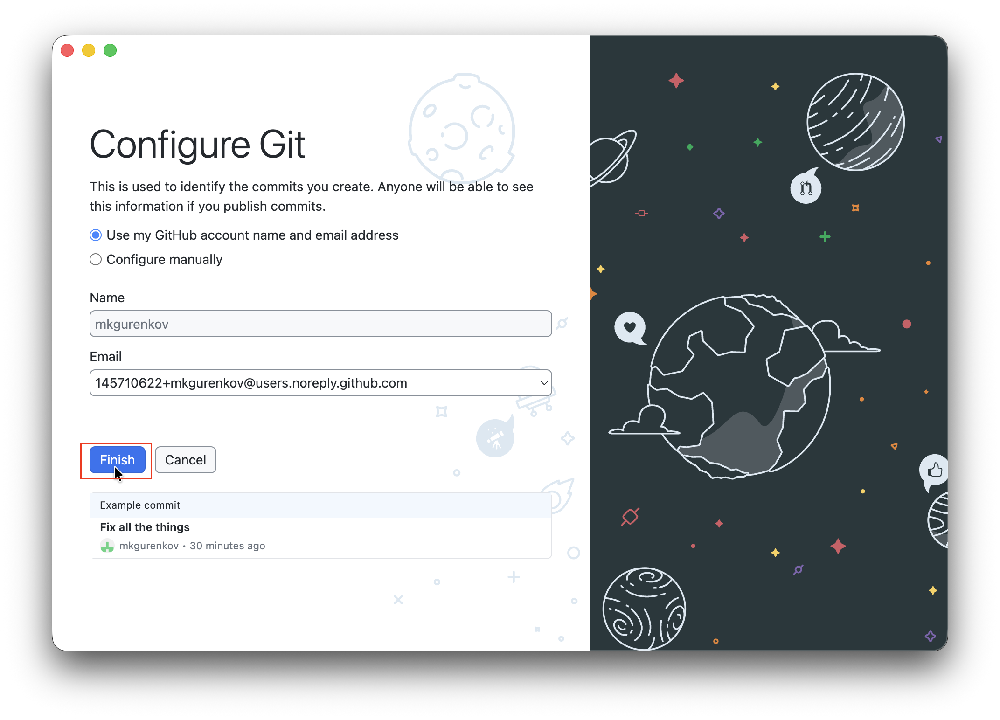

#### 7. Выбрать репозиторий

Дальше необходимо выбрать созданный на шаге 4 репозиторий (вероятно, у вас в списке будет только он один).

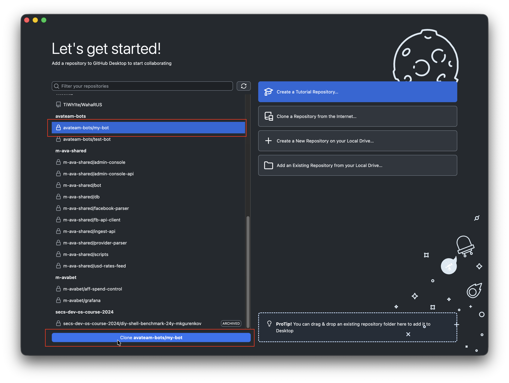

#### 8. Выбрать место на компьютере, куда будет скачан репозиторий

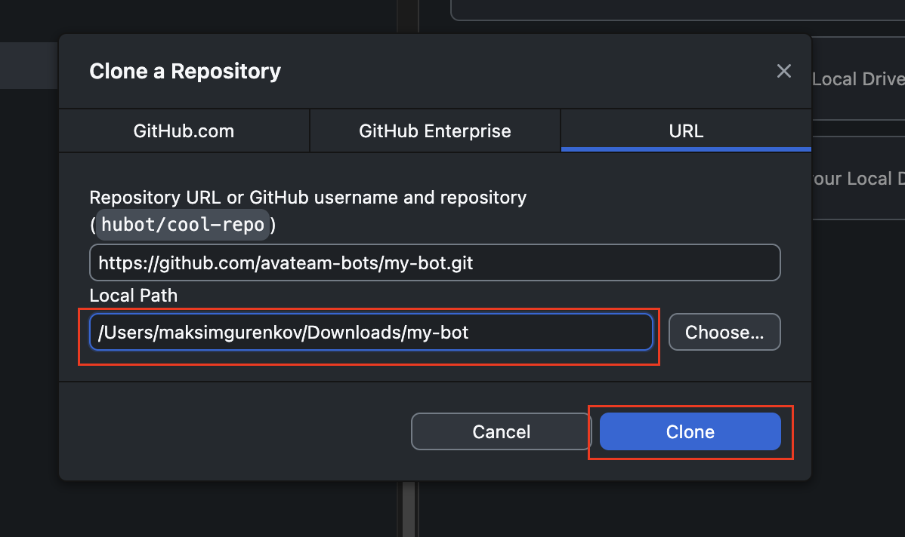

#### 9. После скачивания репозитория

В GitHub Desktop должно открыться вот такое окно. Тут будут отображаться все изменения в репозитории, сделанные локально на вашем компьютере, т. е. любое изменение или добавление файла будет видно здесь. Репозиторий — ваша рабочая папка. Можно добавить её в Codex и приступать к работе (см. раздел «Разработка»).

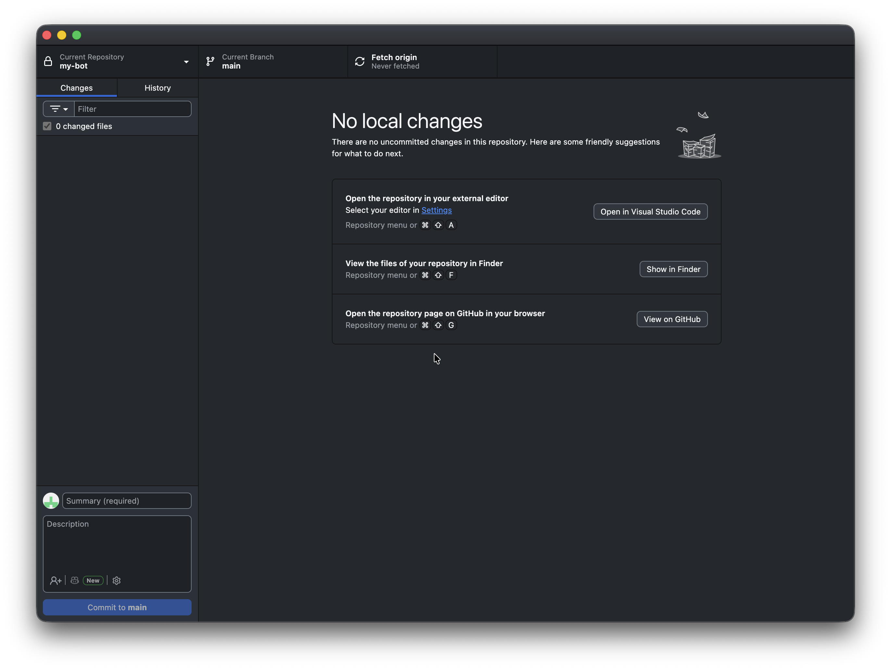

#### 10. Фиксация изменений

После внесения изменений в папке новые и изменённые файлы должны отобразиться в GitHub Desktop. Теперь нужно синхронизировать их с удалённым репозиторием. Некоторые файлы не должны попадать на GitHub: на этапе разработки попросите агента настроить `.gitignore`, чтобы токены, `.env` и рабочие базы данных не попали в репозиторий. Дальше стоит добавить короткое описание ваших изменений и нажать Commit — зафиксировать изменения.

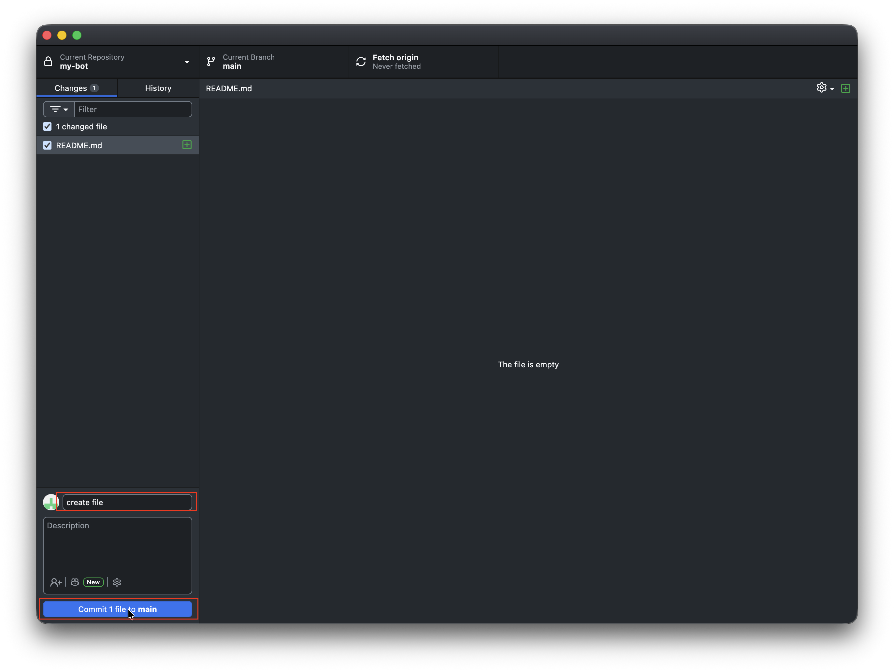

#### 11. Публикация изменений

После фиксации изменений нужно отправить всё в удалённый репозиторий — нажать кнопку Publish branch. При последующих изменениях кнопка будет называться Push origin.

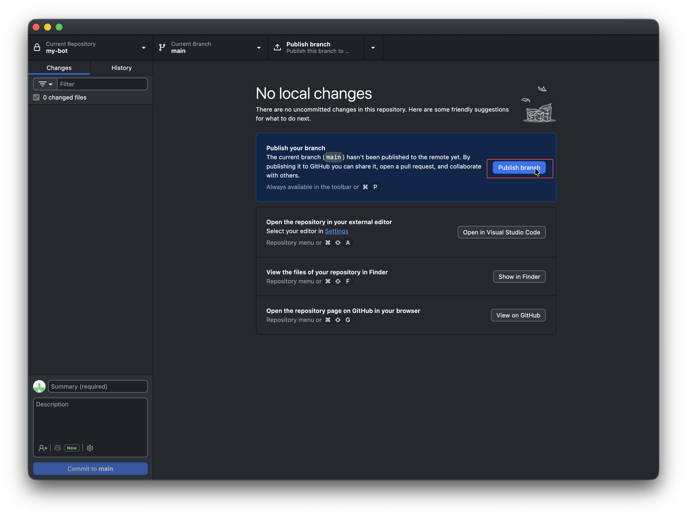

#### 12. Проверка

После отправки изменений через GitHub Desktop они должны быть видны в вашем репозитории на GitHub.

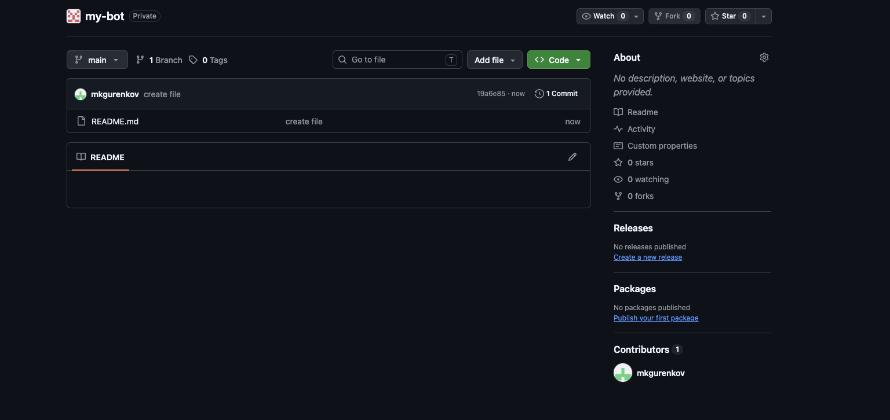

# Разработка

Итак, вы создали репозиторий и склонировали его себе на компьютер. Для развёртывания ваших ботов на сервере в полуавтоматическом режиме код должен соответствовать требованиям, описанным в [AGENTS.md](AGENTS.md). Если это новый бот, то можно скопировать `AGENTS.md` в корень репозитория и начать общение с LLM вот таким образом:

> Прочитай AGENTS.md и разработай Telegram-бота в соответствии с его требованиями.
>
> ... [Ваш промпт]

Если код уже существует, то можно скопировать всё, что есть (кроме папки `.git`, если она имеется), в склонированный репозиторий, туда же скопировать `AGENTS.md` и отправить агенту запрос:

> Прочитай AGENTS.md и изучи существующего бота. Приведи проект в соответствие с требованиями, не меняя функциональность.

Когда ваш бот готов к развёртыванию на сервере, необходимо убедиться, что все последние изменения зафиксированы и синхронизированы с GitHub, и передать администратору:

- ссылку на репозиторий;
- токен бота;
- другие настройки бота (переменные окружения), если они используются;
- информацию о том, используется ли постоянное хранилище данных.

Часть информации можно уточнить у вашего агента и заодно попросить его провести финальную проверку:

> Проверь соответствие проекта AGENTS.md. Собери Docker-образ и проверь запуск контейнера с настройками из окружения. Если есть постоянные данные, проверь их сохранение после пересоздания контейнера с тем же хранилищем. Исправь найденные проблемы и сообщи, что осталось непроверенным.
>
> Подготовь список переменных окружения и укажи, требуется ли постоянное хранилище.

Для этой проверки нужен установленный и запущенный Docker. Если выполнить проверку не получилось, передайте администратору сообщение агента о том, что осталось непроверенным.
